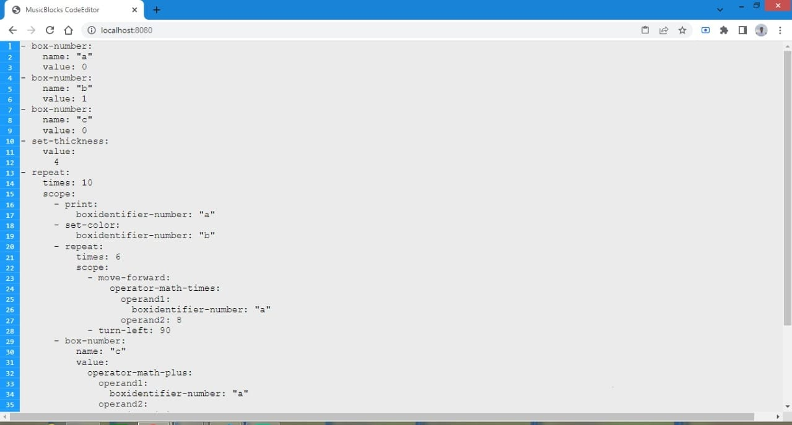

# MusicBlocks v4 Code Editor 
This project implements a code editor for musicblocks v4 custom programming language. There are a lot of code editor libraries out there but all the libraries have a lot of unwanted code to support a wide range of programming languages. It would be pointless to have those libraries when we need to build code editor features for a custom language. This library implements a web text editor that has all features of a code editor tuned towards musicblocks v4 custom programming language.

# Code structure
`./build` - this folder contains the build version of the project.

`./src` - this folder contains the development version of the project.
  
&nbsp;&nbsp;&nbsp;&nbsp;  `./Actions` - All the functions that trigger manipulation of the DOM are placed
      in this folder.
  
&nbsp;&nbsp;&nbsp;&nbsp;  `./css` - All the project styles are saved in this folder.
  
&nbsp;&nbsp;&nbsp;&nbsp;  `./Tasks` - All the taks that can be performed on DOM are saved and exported from this folder.
  
&nbsp;&nbsp;&nbsp;&nbsp;  `./Variables` - All the global variable are stored and exported from this folder.   
  
&nbsp;&nbsp;&nbsp;&nbsp; `./main.js` - This file exports the main class that will be used to append code editor and will contain API's to interact with the code editor.
  
&nbsp;&nbsp;&nbsp;&nbsp;  `./template.html` - this is an html template to be runned on webpack dev server in development mode. This file will not be included during build.

The rest of the files are config files.

# code editor screenshot


# Installation

## Development 

`npm install` to install all the dependency

`npm run start` to start the development server.

Have fun editing code :p ;

## Production 

`npm install` to install all the dependency

` npm run build` to build the project. A single file js file will be created inside `./dist` forlder name `codeEditor.js` use this file to integrate code editor into your project.

### code to import and append code editor - 
```

import codeEditor from './codeEditor.js'

codeEditorContRef = document.getElementById('Code_Editor_Container_main');
let codeEditorDom = new codeEditor.default(codeEditorContRef);
codeEditorDom.createCodeEditorDom();

```
The above code will append the code editor into the DOM inside `.Code_Editor_Container_main` class div.
now you can use all the available api of codeEditor using the instance `codeEditorDom`

